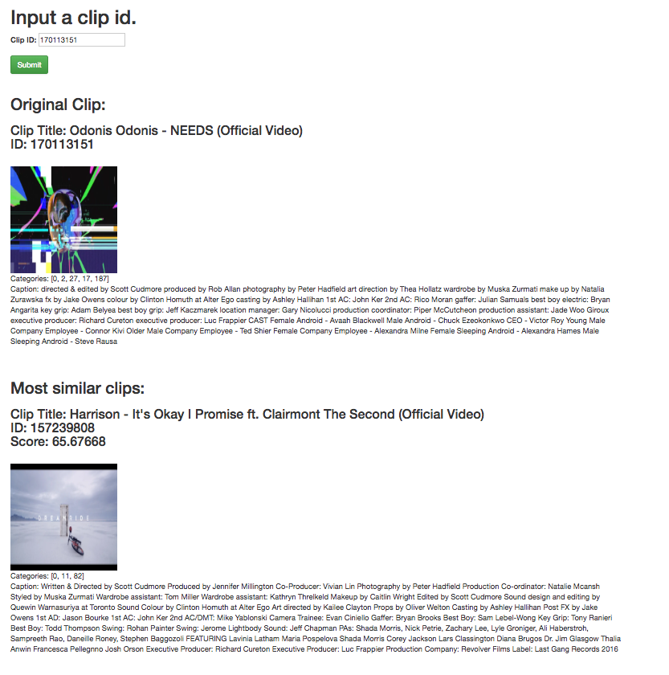

# Vimeo Staff Picks Challenge

#### [Results and write up.](https://github.com/tboser/vimeo-staff-picks-challenge/tree/master/results)

#### Requirements:
Docker and docker-compose: https://www.docker.com/get-started  
1.5GB memory for docker images


### Installation and Use:

```bash
git clone https://github.com/tboser/vimeo-staff-picks-challenge
cd vimeo-staff-picks-challenge
docker-compose up --build -d
```    
The docker containers can be shut down with the command:  
```bash
docker-compose down -v
```

#### Web interface:
After completing the installation the web app will be running at:  
<http://0.0.0.0:5000>  
With a minimalist design:  

  

#### Command line interface:
To access CLI from docker container:  
```bash
docker exec -ti flask-app /bin/bash
```
You can also access the CLI from your own workspace if you install dependencies (requirements.txt), and have python 3.6 installed.

IMPORTANT: when using the CLI from the docker container always pass argument ```-o elasticsearch ``` in order to specify the ES host name (which is not localhost from the docker container).

##### CLI Usage:
```
usage: main.py [-h] [-f] [-p PATH] [-s] [-n MODEL_NAME] [-l] [-o HOST]
               [<clip id>]

Find clips similar to clip_id.

positional arguments:
  <clip id>

optional arguments:
  -h, --help            show this help message and exit
  -f, --fillIndex       Fill ES index with staff pick data.
  -p PATH, --dataPath PATH
                        Set base path to staff picks directory.
  -s, --saveModel       Create snapshot of clips index.
  -n MODEL_NAME, --modelName MODEL_NAME
                        Specify snapshot name when saving/loading.
  -l, --loadModel       Restore a snapshot of clips index.
  -o HOST, --hostName HOST
                        Set elasticsearch host name.
```

If you haven't populated the ES index (when you first run the program), you need to use the ```-l``` flag in order to specify the need to populate the index. The ```-f``` flag also works, but takes longer because it builds the index from the csv data.   

##### Example:  
```python main.py -l 250482473```  

Shortened output:  
```commandline
{
    "250482473": [
        {
            "caption": "I think Jacques Tati's PlayTime is one of the unrivaled great films of all time, but rather than talk about its socio-economic commentary or its myriad of slapstick gags, let's take a minute to dive into its extraordinary (and extraordinarily fun) Royal Garden sequence, and explore the inner workings of chaos unfolding.\r\n\r\nYou can support this channel at Patreon- http://bit.ly/2v27J8x \r\n\r\nFurther Reading-\r\nThe Dance of PlayTime by Jonathan Rosenbaum - http://bit.ly/2ynguss\r\n\r\nYou can follow me through: \r\nTwitter- twitter.com/andymsaladino \r\nYouTube- youtube.com/c/theroyaloceanfilmsociety\r\n\r\n\u201cPillowtalk\u201d and \u201cBonjour\u201d by Jeff Kaale\r\nsoundcloud.com/jeff-kaale",
            "categories": [
                0,
                117,
                175
            ],
            "clip_id": "234536729",
            "thumbnail": "https://i.vimeocdn.com/video/656193550_780x439.webp",
            "title": "PlayTime- Controlled Chaos"
        },

        ... 2 - 9 ... 

        {
            "caption": "Direction / Animation / Sound Design / Edit: Griff\r\n\r\nOriginal concept & Illustration: Scott Garrett\r\nWritten by Scoff & Gritt\r\nVoices: Steve Furst\r\n\r\nAs featured in: Creative Review / STASH / VIMEO Staff Pick / SHORTOFTHEWEEK.com / ItsNiceThat.com / Motionographer.com / DirectorsNotes.com\r\n\r\nOfficial Selection: London Short Film Festival '14 / SF Shorts '13 /  Encounters '13 / The Smalls '13 / Shnit International SFF\r\n\r\nProduced in association with Lupus Films for Channel 4 / Random Acts\r\nCopyright Scott Garrett & Griff 2013",
            "categories": [
                0,
                2,
                7
            ],
            "clip_id": "13533846",
            "thumbnail": "https://i.vimeocdn.com/video/443296401_780x439.webp",
            "title": "WISH LIST"
        }
    ]
}
```
