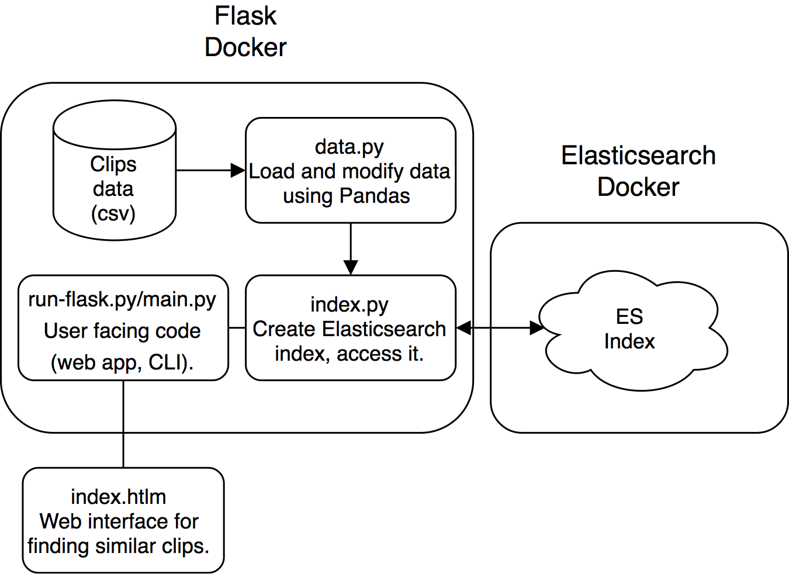

#### Vimeo staff picks challenge writeup
A one page writeup on my experience with this coding challenge.

##### Your approach used and what you liked and disliked about this challenge.
I chose to build an inverted index that uses TF-IDF to find similar clips. Elasticsearch
has a search query "more like this" which uses TF-IDF to very efficiently
find documents (or clips) similar to a document of your specification. Because the data
set I was given was relatively small I had no problem opening the files using Pandas (python 
library) and indexing each clip individually. I used elasticsearch-dsl's persistence to
create a Clip object for indexing and search, which allowed me to index and query in a
more pythonic way. Because my implementation has several dependencies and requires users
to be running Elasticsearch, I decided to Dockerize the whole thing. At the same time I decided
to create a snapshot of the built index so that I could restore the index without rebuilding it
every time a new person decided to use the web app. Because I was already going to use Docker
I decided to build a web app. I've actually never built a web app before, so I picked
up Flask, a popular python API, and built a minimalist web interface to search for similar
clips in the ES index. Here's a diagram showing how the full implementation works:

I really enjoyed working on this challenge. Learning about modern word embedding techniques
when researching my approach was very interesting. Building my first web app was also a lot
of fun for me. I'm huge on working fun projects that let me explore topics I haven't worked
with much, and with this project I tackled issues I'd never dealt with, and learned a lot in
the process.

##### How would you go about building this for real at Vimeo?
Overall I don't think my general solution would need to be changed an incredible
amount. The front-end web app I built is far from something usable, but the idea
of searching an inverted index for similar clips would also be my approach at Vimeo. With
that being said, if I were to build this for real I'd probably start by exploring ways
to gather more features. Several clips had no caption and/or no category
which caused ES to return other clips without captions. In addition, I imagine senior
employees at Vimeo have a better idea than I do of what makes two clips similar. Tweaking
search parameters to improve the results is something I'd want to tackle with a better
idea of what the "ground truth" looks like. Finally, I would'nt build something standalone.
Vimeo must have a large preexisting internal codebase. I'd first study the existing implementation
to work out how I can build something that fits in with what exists.

##### Are there additional techniques you would leverage to improve the results?
Assuming I can't collect more data, and I'm still not given a ground
truth: I give title, caption, and category equal weight when executing a
"more like this" Elasticsearch query. Depending on what feature I feel
is most important, Elasticsearch has a parameter which allows you to
adjust weight the importance of various features. Elasticsearch's [similarity 
module](https://www.elastic.co/guide/en/elasticsearch/reference/current/index-modules-similarity.html)
can also be customized, so if there is a consensus on how to best find similar
clips, it can be implemented. 

Solving this problem without using an inverted index may yield better 
results. If performance is not a consideration, t-SNE (clustering) applied to documents
seems to be a promising approach. Similar to what is done in this github repo: <https://github.com/genekogan/wiki-tSNE>.

##### What performance considerations are important to scale this up to all Vimeo videos and why?
* Cost of insertion and deletion into ES index.
    * Can't re-index all the data all the time!
    * How often are videos being uploaded? Create new index daily?
* Issue: one huge ES cluster or several smaller ones? 
    * In production several clusters may be more useful because you can 
    handles upgrades, re-indexing without as drastic of an effect.
    * <https://www.elastic.co/blog/multiple-elasticsearch-clusters>
* Handling high volume of queries.
    * Need to ensure queries are executed rapidly.
    * Need to ensure client facing server can handle high traffic volume.
    * <https://www.elastic.co/guide/en/elasticsearch/reference/current/tune-for-search-speed.html>